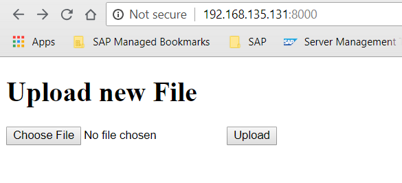
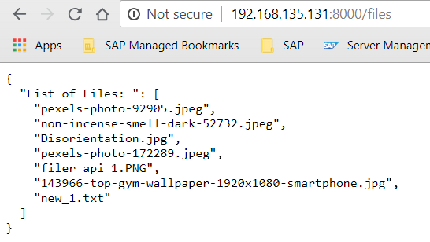
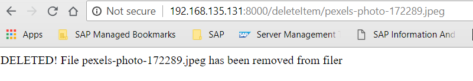

# Filer_flask_api
This program provides an HTTP API to store and retrieve files with the following features:
* Upload a new file
* Retrieve all uploaded files or by file name
* Delete an uploaded file by name
* Dockerfile to build image for hosting this api

## How to build an image and launch the container

No-Proxy
```
# docker build https://github.com/khaiduong/filer_flask_api.git

```

Behind proxy
```
# docker build --build-arg HTTP_PROXY=<your proxy>:<port> https://github.com/khaiduong/filer_flask_api.git

```

Lauch container

```
# docker run -d -p 8000:8000 <image_id>

```

!!NOTE!: you can use your own hostname and port by editing the file ```src/server.py```:

```
if __name__ == '__main__':
    app.run(host='0.0.0.0', port=8000, debug=True)
```

## How to test
After the container has been launched, we can easily reach the api by host's IP address
with port 8000:


!!NOTE: The api limits the maximum allowed payload to 6 megabytes, change it by
editing the file ```src/server.py```:
```
app.config['MAX_CONTENT_LENGTH'] = 6 * 1024 * 1024
```

Retrieve all uploaded files:




or retrieve by a specific filename by url:
```
/files/<filename>
```

##### Remove a file by file name:



### To get the command line output of your app use:
```
docker log -f CONTAINER_ID/NAME
```